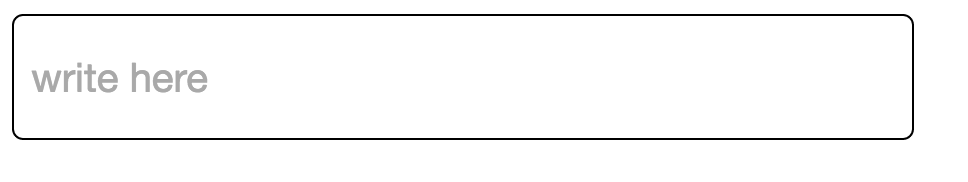
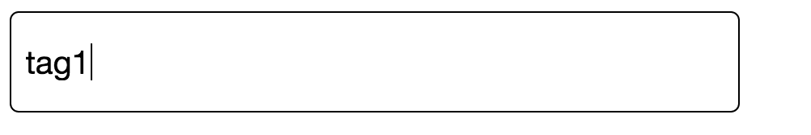
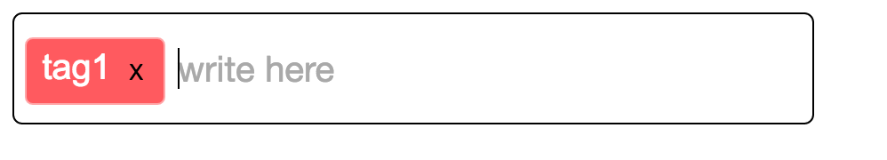
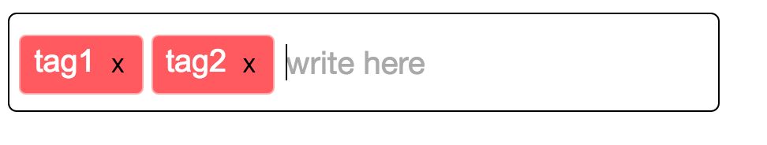
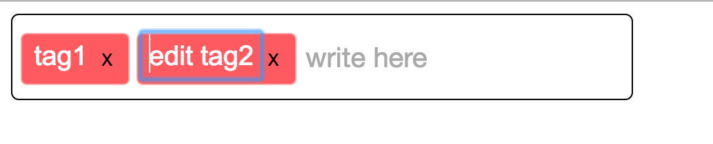

# Tag-Input Component
To make a simple (non styled) tagging input react component.

Current status:

Input field

create a custom tag

press enter key or comma to add tag

can add multiple tags

can edit tags

can delete tags with delete key or pressing 'x' button

### original spec

Key features:
 - [x] Input field
 - [x] Comma creates a tag from last word
 - [x] Some indication of separate tags
 - [x] Delete tag functionality
 - [ ] Arrow keys take curser between tags

Stretch Goals:
 - [x] Edit tag functionality
 - [ ] Arrow keys can be used to select tags
 - [ ] Enter press on selected tag will lead to edit
